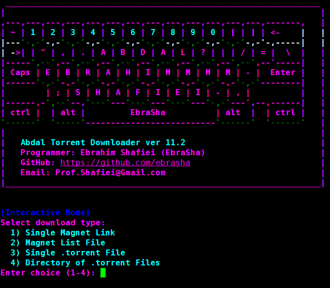

# ابدال تورنت دانلودر

<div align="center">
  
</div>


## 📘 زبان‌های دیگر

- [🇬🇧 English - انگلیسی](README.md)

## 📖 توضیحات

**ابدال تورنت دانلودر** یک دانلودر تورنت حرفه‌ای، تعاملی و مبتنی بر خط فرمان با ویژگی‌های پیشرفته، رابط کاربری سایبرپانک و مدیریت خطای قوی است. این نرم‌افزار با Python و libtorrent ساخته شده و امکان دانلود تورنت‌ها و لینک‌های مگنت را در هر دو حالت خط فرمان و تعاملی فراهم می‌کند.


## ✨ ویژگی‌ها

- 🔥 **حالت تعاملی**: رابط کاربری زیبا با تم سایبرپانک و ورودی‌های رنگی
- 📁 **منابع دانلود متعدد**: پشتیبانی از لینک‌های مگنت تکی، لیست مگنت، فایل‌های .torrent و پوشه‌ها
- ⚡ **تشخیص توقف**: سیستم تایم‌اوت هوشمند که دانلودهای متوقف شده را رد می‌کند بدون اینکه دانلودهای فعال را قطع کند
- 🌐 **پشتیبانی از پراکسی**: پیکربندی پراکسی SOCKS5 برای حفظ حریم خصوصی
- 🎨 **رابط کاربری غنی**: خروجی رنگی با تم سایبرپانک با استفاده از کتابخانه Rich
- 🔄 **پردازش دسته‌ای**: دانلود چندین تورنت با پیگیری پیشرفت
- 📊 **نظارت بر پیشرفت**: پیشرفت دانلود در زمان واقعی با نشانگرهای سرعت
- 🛡️ **مدیریت خطا**: مدیریت خطای قوی با گزارش‌دهی دقیق شکست‌ها

## 🚀 نصب

### پیش‌نیازها

- Python 3.7 یا بالاتر
- کتابخانه libtorrent

### نصب libtorrent

**Ubuntu/Debian:**
```bash
sudo apt update
sudo apt install python3-libtorrent
```

**با استفاده از pip:**
```bash
pip install python-libtorrent
```

**تأیید نصب:**
```bash
python3 -c "import libtorrent as lt; print(lt.version)"
```

### نصب وابستگی‌ها

```bash
pip install -r requirements.txt
```

## 📦 نیازمندی‌ها

فایل `requirements.txt` را با وابستگی‌های زیر ایجاد کنید:

```
python-libtorrent>=2.0.0
prompt_toolkit>=3.0.0
rich>=13.0.0
```

## 🎯 نحوه استفاده

### حالت تعاملی (توصیه شده)

بدون آرگومان اجرا کنید تا وارد حالت تعاملی زیبا شوید:

```bash
python abdal-torrent-downloader.py
```

### حالت خط فرمان

#### لینک مگنت تکی
```bash
python abdal-torrent-downloader.py --magnet "magnet:?xt=urn:btih:..." --out ./downloads
```

#### فایل لیست مگنت
```bash
python abdal-torrent-downloader.py --magnet-list magnets.txt --out ./downloads --stall-timeout 30
```

#### فایل تورنت تکی
```bash
python abdal-torrent-downloader.py --torrent file.torrent --out ./downloads
```

#### پوشه فایل‌های تورنت
```bash
python abdal-torrent-downloader.py --torrent-dir ./torrents --out ./downloads
```

#### با پراکسی SOCKS5
```bash
python abdal-torrent-downloader.py --magnet "magnet:?xt=urn:btih:..." --out ./downloads --socks5 127.0.0.1:1080
```

## ⚙️ آرگومان‌ها

| آرگومان | توضیحات | اجباری |
|----------|-------------|----------|
| `--magnet` | لینک مگنت تکی | خیر |
| `--magnet-list` | فایل متنی حاوی لینک‌های مگنت (یک لینک در هر خط) | خیر |
| `--torrent` | مسیر فایل .torrent تکی | خیر |
| `--torrent-dir` | پوشه حاوی فایل‌های .torrent | خیر |
| `--out` | مسیر خروجی برای دانلودها (برای حالت CLI اجباری) | بله (CLI) |
| `--socks5` | پراکسی SOCKS5 در فرمت ip:port | خیر |
| `--stall-timeout` | تایم‌اوت توقف بر حسب دقیقه (پیش‌فرض: 20) | خیر |

## 🔧 پیکربندی

### تایم‌اوت توقف
ویژگی تایم‌اوت توقف از گیر کردن برنامه روی دانلودهای متوقف شده جلوگیری می‌کند:
- اگر هیچ پیشرفتی در دانلود برای زمان مشخص شده (پیش‌فرض: 20 دقیقه) رخ ندهد، فایل رد می‌شود
- دانلودهای ناموفق در `failed_magnets.txt` یا `failed_torrents.txt` ثبت می‌شوند
- دانلودهای فعال حتی اگر بیشتر از تایم‌اوت طول بکشند، ادامه پیدا می‌کنند

### پیکربندی پراکسی
پشتیبانی از پراکسی SOCKS5 برای حفظ حریم خصوصی:
```bash
--socks5 127.0.0.1:1080
```

## 📁 ساختار فایل

```
abdal-torrent-downloader/
├── abdal-torrent-downloader.py  # فایل اصلی برنامه
├── requirements.txt              # وابستگی‌های Python
├── README.md                   # مستندات انگلیسی
├── README.fa.md                # مستندات فارسی
├── shot.png                    # اسکرین‌شات
└── downloads/                  # پوشه پیش‌فرض دانلود
```

## 🎨 اسکرین‌شات‌ها

برنامه دارای رابط کاربری زیبا با تم سایبرپانک شامل:
- بنر ASCII Art رنگی
- ورودی‌های تعاملی با تکمیل خودکار
- نشانگرهای پیشرفت در زمان واقعی
- خروجی رنگی غنی برای رویدادهای مختلف

## 🔗 لینک‌ها

- **مستندات انگلیسی**: [README.md](README.md)
- **مخزن GitHub**: [https://github.com/ebrasha](https://github.com/ebrasha)

## 🐛 گزارش مشکلات

اگر با مشکلی مواجه شدید یا در پیکربندی مشکل دارید، لطفاً از طریق ایمیل Prof.Shafiei@Gmail.com با ما در تماس باشید. همچنین می‌توانید مشکلات را در GitLab یا GitHub گزارش دهید.

## ❤️ حمایت مالی

اگر این پروژه برای شما مفید بود و مایل به حمایت از توسعه بیشتر هستید، لطفاً در نظر داشته باشید که کمک مالی کنید:
- [اینجا اهدا کنید](https://alphajet.ir/abdal-donation)

## 🤵 برنامه‌نویس

ساخته شده با عشق توسط **ابراهیم شفیعی (EbraSha)**
- **ایمیل**: Prof.Shafiei@Gmail.com
- **تلگرام**: [@ProfShafiei](https://t.me/ProfShafiei)

## 📜 مجوز

این پروژه تحت مجوز GPLv2 or later منتشر شده است. 