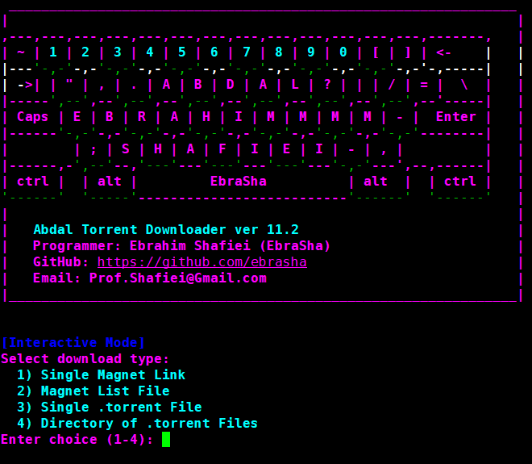

# Abdal Torrent Downloader

<div align="center">
  
</div>

## 📘 Other Languages

- [🇮🇷 Persian - فارسی](README.fa.md)

## 📖 Description

**Abdal Torrent Downloader** is a professional, interactive, and CLI-based torrent downloader with advanced features, cyberpunk UI, and robust error handling. Built with Python and libtorrent, it provides both command-line and interactive modes for downloading torrents and magnet links.

## ✨ Features

- 🔥 **Interactive Mode**: Beautiful cyberpunk-themed user interface with colored prompts
- 📁 **Multiple Download Sources**: Support for single magnet links, magnet lists, .torrent files, and directories
- ⚡ **Stall Detection**: Intelligent timeout system that skips stalled downloads without interrupting active ones
- 🌐 **Proxy Support**: SOCKS5 proxy configuration for enhanced privacy
- 🎨 **Rich UI**: Colored output with cyberpunk theme using Rich library
- 🔄 **Batch Processing**: Download multiple torrents with progress tracking
- 📊 **Progress Monitoring**: Real-time download progress with speed indicators
- 🛡️ **Error Handling**: Robust error handling with detailed failure reporting

## 🚀 Installation

### Prerequisites

- Python 3.7 or higher
- libtorrent library

### Install libtorrent

**Ubuntu/Debian:**
```bash
sudo apt update
sudo apt install python3-libtorrent
```

**Using pip:**
```bash
pip install python-libtorrent
```

**Verify installation:**
```bash
python3 -c "import libtorrent as lt; print(lt.version)"
```

### Install Dependencies

```bash
pip install -r requirements.txt
```

## 📦 Requirements

Create a `requirements.txt` file with the following dependencies:

```
python-libtorrent>=2.0.0
prompt_toolkit>=3.0.0
rich>=13.0.0
```

## 🎯 Usage

### Interactive Mode (Recommended)

Run without arguments to enter the beautiful interactive mode:

```bash
python abdal-torrent-downloader.py
```

### Command Line Mode

#### Single Magnet Link
```bash
python abdal-torrent-downloader.py --magnet "magnet:?xt=urn:btih:..." --out ./downloads
```

#### Magnet List File
```bash
python abdal-torrent-downloader.py --magnet-list magnets.txt --out ./downloads --stall-timeout 30
```

#### Single Torrent File
```bash
python abdal-torrent-downloader.py --torrent file.torrent --out ./downloads
```

#### Directory of Torrent Files
```bash
python abdal-torrent-downloader.py --torrent-dir ./torrents --out ./downloads
```

#### With SOCKS5 Proxy
```bash
python abdal-torrent-downloader.py --magnet "magnet:?xt=urn:btih:..." --out ./downloads --socks5 127.0.0.1:1080
```

## ⚙️ Arguments

| Argument | Description | Required |
|----------|-------------|----------|
| `--magnet` | Single magnet link | No |
| `--magnet-list` | Text file containing magnet links (one per line) | No |
| `--torrent` | Single .torrent file path | No |
| `--torrent-dir` | Directory containing .torrent files | No |
| `--out` | Output path for downloads (required for CLI mode) | Yes (CLI) |
| `--socks5` | SOCKS5 proxy in ip:port format | No |
| `--stall-timeout` | Stall timeout in MINUTES (default: 20) | No |

## 🔧 Configuration

### Stall Timeout
The stall timeout feature prevents the program from hanging on stalled downloads:
- If no download progress occurs for the specified time (default: 20 minutes), the file is skipped
- Failed downloads are logged in `failed_magnets.txt` or `failed_torrents.txt`
- Active downloads continue even if they take longer than the timeout

### Proxy Configuration
SOCKS5 proxy support for enhanced privacy:
```bash
--socks5 127.0.0.1:1080
```


## 🐛 Reporting Issues

If you encounter any issues or have configuration problems, please reach out via email at Prof.Shafiei@Gmail.com. You can also report issues on GitLab or GitHub.

## ❤️ Donation

If you find this project helpful and would like to support further development, please consider making a donation:
- [Donate Here](https://alphajet.ir/abdal-donation)

## 🤵 Programmer

Handcrafted with Passion by **Ebrahim Shafiei (EbraSha)**
- **E-Mail**: Prof.Shafiei@Gmail.com
- **Telegram**: [@ProfShafiei](https://t.me/ProfShafiei)

## 📜 License

This project is licensed under the GPLv2 or later License. 